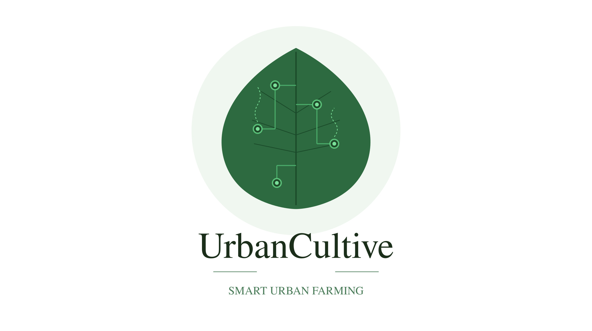

# Guide des Branches de Développement - UrbanCultive

Ce document présente l'organisation du projet UrbanCultive à travers ses deux principales branches de développement sur GitHub : la branche `main` et la branche `develop`. Il explique la transition de la première version stable vers l'écosystème connecté et intelligent.

---

## Logique générale et cycle de vie

Le développement d'UrbanCultive s'organise autour d'un flux de travail simple :

* **Branche `main` :** Version de base stable et autonome du site internet de gestion participative.
* **Branche `develop` :** Version enrichie intégrant l'architecture MVC globale, le tableau de bord IoT en temps réel, l'irrigation connectée et les notifications mobiles.

---

## Branche `main` : Le socle Web stable

La branche `main` contient la première version fonctionnelle du projet. Il s'agit d'une application web monolithique axée sur la gestion administrative et communautaire des parcelles urbaines.

### Structure du code
Dans cette version, l'ensemble de l'application est centralisé dans le dossier `Frontend/` :
* **Frontend/Login/** et **Frontend/Logout/** : Formulaires de connexion, d'inscription et de mise à jour des accès.
* **Frontend/Administrateur/** : Outils pour l'administration des locataires, parcelles et réservations.
* **Frontend/Client/** : Interface utilisateur de consultation, de réservation et d'avis sur les parcelles.
* **Frontend/CRUD/** : Scripts de traitement de données PHP directs.
* **Frontend/BD/** : Scripts de structure et d'initialisation de la base de données.
* **Frontend/PHPMailer/** : Module d'envoi automatique de notifications par email.

### Rôle de la branche
Cette version sert de socle de production classique. Elle valide les flux de base : inscription, réservation de parcelle de culture par un citoyen, approbation administrative, avis communautaires, et alertes emails standard. Elle fonctionne sans aucun équipement électronique ou tableau de bord connecté.

---

## Branche `develop` : La transition vers l'IoT et l'architecture MVC

La branche `develop` marque une refonte majeure de l'application. Elle introduit une structure de code plus robuste et étend les capacités d'UrbanCultive au monde des objets connectés.

### Évolutions majeures
* **Restructuration MVC (Model-View-Controller) :** Le code PHP et Python est désormais distribué à la racine dans des répertoires distincts (`controllers/`, `models/`, `views/`, `services/`, `public/`) afin de séparer la logique métier, la présentation et les requêtes de données.
* **Tableau de bord de monitoring (Streamlit) :** Ajout d'une interface en Python offrant un affichage dynamique de l'état des parcelles (température de l'air, luminosité et humidité du sol) mis à jour en temps réel via des flux MQTT.
* **Irrigation planifiée et automatisée (Flask / Flask-APScheduler) :** Mise en œuvre d'un serveur API Flask coordonnant des tâches d'arrosage planifiées à intervalle régulier, ou automatisées selon des seuils environnementaux paramétrables par le client.
* **Notifications mobiles Telegram :** Intégration d'un service d'alerte Telegram instantané pour informer l'utilisateur des actions du système.
* **Matériel et Firmware (Arduino) :** Ajout des programmes C++ pour Arduino Uno (acquisition capteurs) et ESP32 (communication réseau MQTT).

### Rôle de la branche
Cette branche sert de zone de développement actif pour toutes les fonctionnalités intelligentes et physiques du projet. Elle prépare la future version d'UrbanCultive en transformant le simple site de réservation en un système d'agriculture urbaine connectée.

## 🎬 Démonstration Vidéo

Une démonstration complète du projet est disponible en vidéo. Elle vous permettra de voir UrbanCultive en action, de la gestion des parcelles au monitoring IoT en temps réel.

> 👆 Cliquez sur l'image pour regarder la démonstration sur YouTube.
